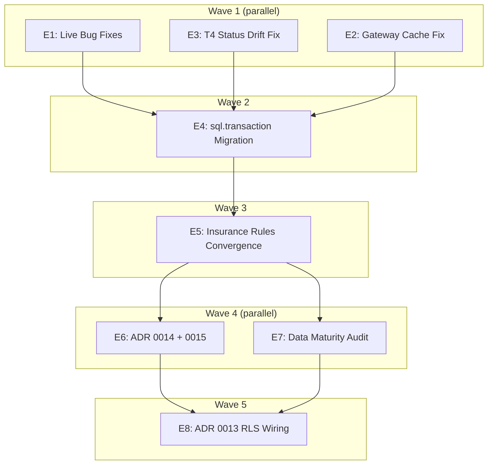

# Build Plan — Policy Intelligence Hardening (2026-06-27)

> Controller: **C0** | 8 Engineers | 5 Waves | Target: 2 weeks
>
> Agent files: `.agents/agents/C0-controller.agent.md` through `E8-rls-wiring.agent.md`

## Dependency Graph



## Engineer Roster

| ID | Agent File | Wave | Role | Parallel? |
|----|-----------|------|------|-----------|
| C0 | `C0-controller.agent.md` | All | Project Lead, PR gate, glossary owner | — |
| E1 | `E1-bug-fixes.agent.md` | 1 | Decision-log ON CONFLICT + dead code removal | Yes |
| E2 | `E2-gateway-cache.agent.md` | 1 | Gateway cache ruleset selection fix | Yes |
| E3 | `E3-t4-status-drift.agent.md` | 1 | T4 status vocabulary reconciliation | Yes |
| E4 | `E4-sql-transaction.agent.md` | 2 | sql.transaction() on all write paths | No |
| E5 | `E5-insurance-convergence.agent.md` | 3 | Converge insurance_policy_rules → policy_rules | No |
| E6 | `E6-client-defined-rules.agent.md` | 4 | ADR 0014 + 0015: client-defined rules + staff gate | Yes (with E7) |
| E7 | `E7-data-maturity-audit.agent.md` | 4 | Data Maturity Audit report + portal panel | Yes (with E6) |
| E8 | `E8-rls-wiring.agent.md` | 5 | ADR 0013: RLS enforcement on client path | No |

**To invoke an engineer:** Use the subagent with the agent file name, e.g., `runSubagent({ agentName: "E1-bug-fixes", prompt: "Start Wave 1 tasks." })`.

## Agent Context Bundles

Each agent file includes its required context docs. Here's the full matrix:

| Agent | CLAUDE.md | CONTEXT.md | Policy Docs | ADRs |
|-------|-----------|------------|-------------|------|
| E1 | ✓ | ✓ | 08-gateway.md, 03-taxonomy.md | — |
| E2 | ✓ | ✓ | 08-gateway.md, 04-backtest.md | — |
| E3 | ✓ | ✓ | 02-extraction.md, 06-schema.md | 0012 |
| E4 | ✓ | ✓ | data-layer.md, audit-engine.md, ingestion.md, 06-schema.md | — |
| E5 | ✓ | ✓ | 00-glossary.md, 06-schema.md, 04-backtest.md, 03-taxonomy.md | 0001 |
| E6 | ✓ | ✓ | 02-extraction.md, 06-schema.md | 0014, 0015 |
| E7 | ✓ | ✓ | 05-readiness.md, 03-taxonomy.md, portal.md | — |
| E8 | ✓ | ✓ | data-protection.md, data-layer.md, 06-schema.md | 0013 |

---

## Controller: C0 (Project Lead)

**Role**: Gatekeeper. No code reaches `main` without C0 review. Owns cross-cutting docs.

**Responsibilities**:
- Assign waves, resolve merge conflicts between engineers
- Review every PR for invariant compliance (CLAUDE.md invariants #1–10)
- Keep `CONTEXT.md` glossary in sync with code changes
- Keep `BACKLOG.md` status markers accurate
- Final approval on any schema migration touching `policy_rules` or `policy_rulesets`
- Run the full test suite (`npm test`) between waves and before merge

**Docs owned by C0**:
| File | When to edit |
|------|-------------|
| `CLAUDE.md` | Any invariant or convention change |
| `CONTEXT.md` | Any glossary term change |
| `docs/BACKLOG.md` | Mark items done/resolved/decided |
| `docs/BUILD-PLAN-PHASE2.md` | This file — wave progress tracking |

**Checkpoints**:
- [ ] Wave 1 complete — all 3 engineers merged, full test suite passes
- [ ] Wave 2 complete — `sql.transaction()` on all paths, rollback test passes
- [ ] Wave 3 complete — insurance rules migrated, old table dropped, evaluator reads single source
- [ ] Wave 4 complete — client Define works end-to-end, staff review queue exists, Data Maturity report renders
- [ ] Wave 5 complete — RLS isolation test passes on CI branch, portal reads scoped

---

## Wave 1 — Parallel (no file overlap)

### E1: Live Bug Fixes

**Context docs to load before starting**:
1. `CLAUDE.md` — invariants, conventions
2. `CONTEXT.md` — gateway terminology, attestation authority, gateway tag authority
3. `docs/policy-intelligence/08-gateway.md` — Gateway service architecture
4. `docs/policy-intelligence/03-taxonomy.md` — gateway decision enums

**Files owned by E1**:
| File | Action |
|------|--------|
| `services/gateway/src/decision-log.ts` | Fix: `INSERT … ON CONFLICT (id) DO NOTHING` in `drainBuffer` |
| `lib/intelligence/embeddings.ts` | Remove dead `cosineSimilarity()` function (lines ~88–100) |

**Tasks**:

1. **Decision-log buffer wedge fix**
   - In `services/gateway/src/decision-log.ts`, locate `drainBuffer()` INSERT statement (~line 68)
   - Change from `INSERT INTO gateway_decisions (id, ...) VALUES ($1, ...)` to `INSERT INTO gateway_decisions (id, ...) VALUES ($1, ...) ON CONFLICT (id) DO NOTHING`
   - Verify: after fix, a partial drain replay does not throw PK violation
   - No migration needed — schema unchanged
   - Acceptance: existing tests pass; manual test: insert a decision, force a partial failure, re-drain — buffer truncates

2. **Remove dead `cosineSimilarity` code**
   - In `lib/intelligence/embeddings.ts`, remove the `cosineSimilarity()` function (~lines 88–100)
   - Verify: grep for `cosineSimilarity` across codebase — zero remaining callers after removal
   - Acceptance: `npm test` passes; no new lint warnings

**Deliverables**: 1 PR with both fixes. C0 reviews.

---

### E2: Gateway Cache Fix

**Context docs to load before starting**:
1. `CLAUDE.md` — invariants, conventions
2. `CONTEXT.md` — Gateway definition, ruleset lifecycle, effective-dating
3. `docs/policy-intelligence/08-gateway.md` — cache architecture, `warmCache` contract
4. `docs/policy-intelligence/04-backtest.md` — effective-dated ruleset selection (same concept)

**Files owned by E2**:
| File | Action |
|------|--------|
| `services/gateway/src/cache.ts` | Fix `warmCache` ruleset selection logic (~line 128) |
| `db/migrations/0021_gateway_active_flag.sql` | NEW: add `gateway_active` boolean column |

**Tasks**:

1. **Fix ruleset selection in `warmCache`**
   - In `services/gateway/src/cache.ts`, locate the version comparison logic (~line 128: `existing.version >= rs.version`)
   - Replace with: select active ruleset by `effective_from DESC, created_at DESC` with `WHERE status = 'active' AND effective_from <= NOW() AND (gateway_active IS TRUE OR gateway_active IS NULL)`
   - Remove ALL lexicographic version string comparison
   - If `gateway_active` column doesn't exist yet, use `WHERE status = 'active' AND effective_from <= NOW() ORDER BY effective_from DESC, created_at DESC LIMIT 1`
   - Acceptance: on a client with version "10" and version "9" both active, "10" (later `effective_from`) is selected

2. **Add `gateway_active` column (migration)**
   - Create migration `0021_gateway_active_flag.sql`:
     ```sql
     ALTER TABLE policy_rulesets ADD COLUMN IF NOT EXISTS gateway_active BOOLEAN DEFAULT FALSE;
     ```
   - Add column to `db/schema.ts`: `gateway_active: boolean` on `policyRulesets` table
   - Default `FALSE` means staff must explicitly opt-in a ruleset for gateway enforcement
   - Acceptance: migration applies idempotently; column visible in `schema.ts`

**Deliverables**: 1 PR with cache fix + migration + schema update. C0 reviews.

---

### E3: T4 Status Drift Fix

**Context docs to load before starting**:
1. `CLAUDE.md` — invariants (especially #4: AI suggest-only, #10: human-reviewed activation)
2. `CONTEXT.md` — Ruleset lifecycle, T4 dashboard, attestation
3. `docs/policy-intelligence/02-extraction.md` — pipeline architecture, T4 trust boundary
4. `docs/policy-intelligence/06-schema.md` — `policy_scope_exclusions` table, CHECK constraints from migration 0016
5. `docs/adr/0012-four-tier-extraction-classification.md` — T4 Define/Exclude/Flag design

**Files owned by E3**:
| File | Action |
|------|--------|
| `app/(portal)/portal/policy-review/actions.ts` | Fix `flagClauseAction` status + `excluded_by` |
| `lib/intelligence/policy-service.ts` | Fix `storeUnmappedClause` dedup query (~line 1291) |
| `lib/intelligence/taxonomy.ts` | Verify `ClassificationSource` includes `VECTOR_NEAR_MATCH` |
| `db/migrations/0022_t4_status_vocabulary.sql` | NEW: add `flagged_at`, `flagged_by` columns |

**Tasks**:

1. **Fix `flagClauseAction` status value**
   - Current: writes `status = 'staff_review'` (NOT in the 0016 CHECK: `pending_review | staff_approved | staff_rejected | excluded | defined`)
   - Fix: keep `status = 'pending_review'`, ADD `flagged_at = NOW()`, ADD `flagged_by = session.user.id`
   - This keeps the row in a CHECK-compatible status while recording that the client flagged it
   - Verify `excluded_by` already stores `session.user.id` (fixed in Wave 2 — confirm it's still correct)

2. **Add `flagged_at` / `flagged_by` columns**
   - Create migration `0022_t4_status_vocabulary.sql`:
     ```sql
     ALTER TABLE policy_scope_exclusions ADD COLUMN IF NOT EXISTS flagged_at TIMESTAMPTZ;
     ALTER TABLE policy_scope_exclusions ADD COLUMN IF NOT EXISTS flagged_by TEXT;
     ```
   - Update `db/schema.ts` accordingly
   - Acceptance: columns exist; `flagClauseAction` sets them; 0016 CHECK is satisfied (status stays `pending_review`)

3. **Fix `storeUnmappedClause` dedup query**
   - In `lib/intelligence/policy-service.ts` ~line 1291, change dedup from `WHERE status = 'pending_review'` to:
     ```sql
     WHERE client_id = $1 AND clause_text = $2 AND deleted_at IS NULL
     ```
   - This prevents ANY previously-decided clause (defined, excluded, flagged, staff_approved, staff_rejected) from re-surfacing as a new `pending_review` row
   - Acceptance: after a client Defines/Excludes/Flags a clause, re-running `classify()` does not create a new `pending_review` row for that clause

4. **Remove `staff_review` references**
   - Grep codebase for `staff_review` (the status string)
   - Any UI or query filtering on `status = 'staff_review'` must be updated to filter on `flagged_at IS NOT NULL AND status = 'pending_review'`
   - Acceptance: zero references to `'staff_review'` as a `policy_scope_exclusions.status` value

**Deliverables**: 1 PR with all 4 fixes. C0 reviews against the "never re-surface a decided clause" invariant.

---

## Wave 2 — Sequential (depends on Wave 1)

### E4: `sql.transaction()` Migration

**Context docs to load before starting**:
1. `CLAUDE.md` — invariant #3 (updated), conventions
2. `docs/data-layer.md` — DB access patterns, `getSql()`, Neon driver docs
3. `docs/audit-engine.md` — engine write paths (parcel, 3PL)
4. `docs/policy-intelligence/06-schema.md` — tables affected by transaction writes
5. `docs/ingestion.md` — `batchCreate` write path

**Files owned by E4**:
| File | Action |
|------|--------|
| `lib/audit/engine.ts` | Wrap audit write in `sql.transaction([...])` |
| `lib/audit/3pl-engine.ts` | Wrap 3PL write in `sql.transaction([...])` |
| `app/(portal)/portal/policy-review/actions.ts` | Wrap `defineClauseAction` in `sql.transaction([...])` |
| `lib/ingestion/batchCreate.ts` (or equivalent) | Wrap batch create in `sql.transaction([...])` |
| `lib/intelligence/policy-service.ts` | Wrap attestation/activation in `sql.transaction([...])` |
| `lib/__tests__/transaction.test.ts` | NEW: integration test for rollback behavior |

**Tasks**:

1. **Audit `batchCreate`**
   - Find the batch create function (likely in `lib/ingestion/` or `lib/db/`)
   - Replace raw `BEGIN`/`COMMIT` with `sql.transaction([...])` array of SQL statements
   - The `{ inTransaction: true }` flag should skip the outer `sql.transaction()` wrapper
   - Acceptance: batch create with a deliberate mid-batch failure rolls back completely

2. **Audit `defineClauseAction`**
   - In `app/(portal)/portal/policy-review/actions.ts`, the define action does: UPDATE scope exclusion + INSERT policy_rule
   - These MUST be atomic: if the INSERT fails, the UPDATE must roll back
   - Wrap both in `sql.transaction([updateStatement, insertStatement])`
   - Acceptance: partial failure leaves no partial state

3. **Audit `engine.ts` and `3pl-engine.ts`**
   - Locate all `sql.query('BEGIN')` / `sql.query('COMMIT')` pairs
   - Replace with `sql.transaction([...])` wrapping the write statements
   - Watch for conditional logic between BEGIN and COMMIT — extract to variables, pass to transaction array
   - Acceptance: engine writes are atomic

4. **Audit `policy-service.ts` attestation/activation**
   - `activateRulesetAction` and `attestRulesetAction` may have multi-statement writes
   - Wrap in `sql.transaction([...])`
   - Acceptance: activation is atomic

5. **Integration test**
   - Create `lib/__tests__/transaction.test.ts`
   - Test: `sql.transaction([validInsert, invalidInsert])` → full rollback, nothing persisted
   - Test: `sql.transaction([validInsert, validInsert])` → both persisted
   - Skip locally unless `TEST_DATABASE_URL` is set
   - Acceptance: CI catches partial-commit bugs

**Deliverables**: 1 PR per file (5 total). C0 reviews each, runs full test suite after merge.

---

## Wave 3 — Sequential (depends on Wave 2)

### E5: Converge `insurance_policy_rules` → `policy_rules`

**Context docs to load before starting**:
1. `CLAUDE.md` — invariants
2. `CONTEXT.md` — updated glossary (insurance convergence, attestation authority)
3. `docs/policy-intelligence/00-glossary.md` — updated direction
4. `docs/policy-intelligence/06-schema.md` — both table schemas, FK constraints
5. `docs/policy-intelligence/04-backtest.md` — evaluator contract
6. `docs/policy-intelligence/03-taxonomy.md` — insurance risk categories
7. `docs/adr/0001-backtest-shipment-context-model.md` — Linked Audit spine

**Files owned by E5**:
| File | Action |
|------|--------|
| `db/migrations/0023_converge_insurance_rules.sql` | NEW: migration to migrate data + drop old table |
| `db/schema.ts` | Update: remove `insurancePolicyRules`, add insurance columns to `policyRules` |
| `lib/intelligence/policy-evaluator.ts` | Update: remove `insurance_policy_rules` read path |
| `lib/intelligence/policy-service.ts` | Update: remove insurance rule CRUD, unify under `policy_rules` |
| `lib/intelligence/reports.ts` | Update: `getInsuranceExposureReport` reads from `policy_rules` |
| `app/(console)/policies/` | Update: rule editor works with unified `policy_rules` |
| `lib/intelligence/__tests__/policy-evaluator.test.ts` | Update: test with unified rules |

**Tasks**:

1. **Migration: migrate data, drop old table**
   - Create `0023_converge_insurance_rules.sql`:
     ```sql
     -- Step 1: Insert insurance_policy_rules rows into policy_rules
     INSERT INTO policy_rules (id, client_id, ruleset_id, policy_id, document_id,
       rule_key, category, condition_json, action_json, severity, clause_ref,
       status, created_at, updated_at)
     SELECT id, client_id, NULL as ruleset_id, policy_id, NULL as document_id,
       rule_key, category, condition_json, action_json, severity, clause_ref,
       'active' as status, effective_from as created_at, effective_to as updated_at
     FROM insurance_policy_rules
     ON CONFLICT (id) DO NOTHING;
     
     -- Step 2: Drop the old table (only after confirming data migration)
     DROP TABLE IF EXISTS insurance_policy_rules CASCADE;
     ```
   - The `ruleset_id = NULL` is intentional — these rules predate rulesets and will be assigned during client onboarding
   - Acceptance: migration applies idempotently; `insurance_policy_rules` table gone

2. **Update evaluator to single source**
   - In `lib/intelligence/policy-evaluator.ts`, remove any code path that reads `insurance_policy_rules`
   - The evaluator should read ONLY `policy_rules` joined through `policy_rulesets`
   - Acceptance: evaluator tests pass with rules from `policy_rules` only

3. **Update policy-service.ts write paths**
   - Remove `addInsuranceRule`, `updateInsuranceRule`, `getInsuranceRules` functions
   - All rule CRUD goes through the unified `policy_rules` functions
   - Acceptance: insurance rule creation works through the standard rule editor

4. **Update reports**
   - `getInsuranceExposureReport()` in `reports.ts` now reads from `policy_rules` with `category LIKE 'insurance_%'`
   - Acceptance: insurance exposure report returns same data

5. **Update schema.ts**
   - Remove `insurancePolicyRules` table definition
   - Ensure `policyRules` has all needed columns
   - Acceptance: `npm run build` passes

**Deliverables**: 1 PR with migration + all code changes. **Requires C0 final approval before merge** (schema change).

---

## Wave 4 — Parallel (depends on Wave 3)

### E6: ADR 0014 + ADR 0015 (Client-Defined Rules + Staff Review Gate)

**Context docs to load before starting**:
1. `CLAUDE.md` — invariants (especially #4, #10)
2. `CONTEXT.md` — Ruleset lifecycle, attestation authority, T4 vocabulary
3. `docs/policy-intelligence/02-extraction.md` — T4 trust boundary, `CLIENT_DEFINED` signal
4. `docs/policy-intelligence/06-schema.md` — `policy_rules` table, `staff_reviewed` column
5. `docs/adr/0014-client-defined-rule-home.md` — copy-forward design
6. `docs/adr/0015-staff-review-gate-for-client-defined-rules.md` — staff review workflow

**Files owned by E6**:
| File | Action |
|------|--------|
| `app/(portal)/portal/policy-review/actions.ts` | Fix `defineClauseAction`: attach to draft ruleset, copy-forward |
| `lib/intelligence/policy-service.ts` | Add `findOrCreateClientDraftRuleset()`, `findOrCreateNextDraft()` |
| `app/(console)/console/policies/actions.ts` | Add `activateRulesetAction` staff review gate |
| `app/(console)/console/policies/` | NEW: staff review queue UI for unreviewed `CLIENT_DEFINED` rules |
| `db/migrations/0024_staff_review_queue.sql` | NEW: ensure `staff_reviewed` column constraints |

**Tasks**:

1. **ADR 0014: `findOrCreateClientDraftRuleset(clientId)`**
   - A client gets exactly ONE draft ruleset. If none exists, create one with copy-forward from the active ruleset.
   - Copy-forward: INSERT all active ruleset's rules into the new draft (additive, not destructive).
   - Version naming: `Client-Defined-<timestamp>` to avoid UNIQUE constraint on `(client_id, version)`.
   - Acceptance: first Define creates draft ruleset with all active rules copied forward; subsequent Defines add to the same draft.

2. **ADR 0014: Fix `defineClauseAction`**
   - Rule INSERT must include `ruleset_id` (from `findOrCreateClientDraftRuleset`), `signal_source = 'CLIENT_DEFINED'`, `status = 'draft'`, `staff_reviewed = FALSE`.
   - Scope-exclusion UPDATE + rule INSERT must be atomic (already handled by E4's `sql.transaction()` migration).
   - Acceptance: client clicks Define → rule appears in draft ruleset, scope exclusion marked `defined`.

3. **ADR 0015: Staff review gate in `activateRulesetAction`**
   - When activating a ruleset, check: are there any `CLIENT_DEFINED` rules with `staff_reviewed = FALSE`?
   - If yes: those rules are EXCLUDED from activation (they stay `draft` in the draft ruleset). Log a warning.
   - If no unreviewed rules: activate normally.
   - Acceptance: unreviewed `CLIENT_DEFINED` rule never reaches `active` status.

4. **ADR 0015: Staff review queue UI**
   - New console page or tab: "Client-Defined Rules Pending Review"
   - Lists all `policy_rules` with `signal_source = 'CLIENT_DEFINED'` AND `staff_reviewed = FALSE`
   - Staff can review each rule against source document, then approve (`staff_reviewed = TRUE`, `reviewed_by = session.user.id`, `reviewed_at = NOW()`) or reject (delete or set `status = 'archived'`)
   - Acceptance: staff can clear the review queue; approved rules become attestable.

**Deliverables**: 1 PR for ADR 0014, 1 PR for ADR 0015. C0 reviews both, verifies end-to-end: client Define → staff review → activation.

---

### E7: Data Maturity Audit ($500 Deliverable)

**Context docs to load before starting**:
1. `CLAUDE.md` — invariants
2. `CONTEXT.md` — Data Readiness definition, Compliance Tab architecture
3. `docs/policy-intelligence/05-readiness.md` — assessment output, report helpers
4. `docs/policy-intelligence/03-taxonomy.md` — `PolicyCondition` fields consumed
5. `docs/portal.md` — portal component patterns, data-loader

**Files owned by E7**:
| File | Action |
|------|--------|
| `lib/intelligence/reports.ts` | Add `getDataReadinessReport(clientId)` |
| `lib/portal/data-loader.ts` | Wire `dataReadiness` into Compliance payload |
| `components/portal/data-readiness-panel.tsx` | NEW: client-facing report panel |
| `app/(console)/console/data-readiness/[clientId]/page.tsx` | NEW: staff console report page |

**Tasks**:

1. **`getDataReadinessReport(clientId)`**
   - For each `PolicyCondition` field, compute null-rate across the client's shipments:
     - `declaredValue` → `SELECT COUNT(*) FILTER (WHERE "Declared value" IS NULL) * 1.0 / COUNT(*) FROM "Shipments"`
     - `signatureType` → same pattern
     - `shipperVertical` → same pattern
     - etc. for all fields in `CONDITION_TO_CONTEXT_FIELD` mapping
   - Cross-reference with active rules: for each field, count how many active rules depend on it
   - Return: `{ field, nullRate, requiredByRulesCount, dependentRules: [{ ruleKey, category }] }`
   - Acceptance: report shows "declared_value: 73% null, required by 5 active rules"

2. **Portal panel: Data Readiness Diagnostic**
   - New panel in the Compliance tab: "Data Maturity"
   - Shows per-field completeness with color coding (green ≥90%, yellow ≥70%, red <70%)
   - "Rules blocked by missing data" count
   - Call-to-action: "Improve data capture to unlock Compliance Risk Assessment"
   - Acceptance: panel renders in portal Compliance tab below Coverage Gap Feed

3. **Staff console report**
   - Staff page at `/data-readiness/[clientId]` shows same data with additional detail
   - "This client qualifies for: [Data Maturity Audit only / Full Compliance Risk Assessment]" based on completeness thresholds
   - Acceptance: staff can determine pricing tier from this page

**Deliverables**: 1 PR. C0 reviews against portal design patterns in `docs/portal.md`.

---

## Wave 5 — Sequential (depends on Wave 4)

### E8: ADR 0013 — RLS Wiring

**Context docs to load before starting**:
1. `CLAUDE.md` — invariants
2. `CONTEXT.md` — Client scoping, tenant isolation
3. `docs/data-protection.md` — RLS design, `app_tenant` role, `getTenantSql()`
4. `docs/data-layer.md` — DB access patterns
5. `docs/adr/0013-rls-enforcement-on-the-client-path.md` — full RLS design
6. `docs/policy-intelligence/06-schema.md` — tables requiring RLS policies

**Files owned by E8**:
| File | Action |
|------|--------|
| `lib/db.ts` | Wire `getTenantSql(clientId)` into portal read paths |
| `lib/portal/data-loader.ts` | Portal reads use `getTenantSql(session.user.clientId)` |
| `lib/portal/records.ts` | Add optional `db` param to read helpers |
| `db/migrations/0025_rls_portal_policies.sql` | NEW: RLS policies + grants for portal read-set |
| `lib/__tests__/rls-isolation.test.ts` | NEW: behavioral RLS test |

**Tasks**:

1. **Wire `getTenantSql` into portal data-loader**
   - `portalDataLoader()` acquires `getTenantSql(session.user.clientId)` once per request
   - Release in `finally` block
   - Staff console / audit engine / BI stay on owner `getSql()`
   - Acceptance: portal reads run as `app_tenant` with `app.current_tenant` set; staff reads unaffected

2. **Create RLS migration**
   - `0025_rls_portal_policies.sql`:
     - GRANT SELECT on portal-read tables to `app_tenant`
     - Add RLS policies: `Clients` (own-row), `policy_rulesets` (own-client), `policy_attestations` (own-client), `policy_scope_exclusions` (own-client)
     - Re-assert `ALTER TABLE ... FORCE ROW LEVEL SECURITY` (idempotent)
   - Apply ONLY after E6's schema changes are deployed and stable
   - Acceptance: policies exist; portal reads succeed; cross-client reads fail

3. **Behavioral RLS isolation test**
   - Create `lib/__tests__/rls-isolation.test.ts`
   - Test 1: connect as `app_tenant` with no tenant set → 0 rows returned
   - Test 2: seed client A + client B data → connect as client A → assert cannot read client B's `policy_rulesets`
   - Test 3: staff `getSql()` can read all clients
   - Gated on `TEST_DATABASE_URL` env var; runs in CI (Neon branch), skips locally
   - Acceptance: CI catches any isolation breach

4. **Update `records.ts` helpers**
   - Add optional `db` parameter to `fetchRecords`, `fetchAllRecords`, `findByField`
   - Default to `getSql()` for backward compatibility
   - Portal paths pass the tenant-scoped client
   - Acceptance: existing tests pass with default `getSql()`

**Deliverables**: 1 PR. **Requires C0 final approval** (security boundary change).

---

## File Ownership Matrix (no conflicts)

| File | Owner |
|------|-------|
| `services/gateway/src/decision-log.ts` | E1 |
| `lib/intelligence/embeddings.ts` | E1 |
| `services/gateway/src/cache.ts` | E2 |
| `app/(portal)/portal/policy-review/actions.ts` | E3 (Wave 1) → E4 (Wave 2) → E6 (Wave 4) |
| `lib/intelligence/policy-service.ts` | E3 (Wave 1) → E4 (Wave 2) → E5 (Wave 3) → E6 (Wave 4) |
| `lib/intelligence/taxonomy.ts` | E3 |
| `lib/audit/engine.ts` | E4 |
| `lib/audit/3pl-engine.ts` | E4 |
| `lib/ingestion/` (batch create) | E4 |
| `lib/intelligence/policy-evaluator.ts` | E5 |
| `lib/intelligence/reports.ts` | E5 (Wave 3) → E7 (Wave 4) |
| `app/(console)/policies/` | E5 (Wave 3) → E6 (Wave 4) |
| `lib/portal/data-loader.ts` | E7 (Wave 4) → E8 (Wave 5) |
| `lib/portal/records.ts` | E8 |
| `lib/db.ts` | E8 |
| `components/portal/` (new panels) | E7 |
| `db/migrations/` (new) | Per-engineer, C0 approves |
| `db/schema.ts` | Per-engineer, C0 resolves conflicts |
| `lib/__tests__/` (new) | E4, E8 |

**C0 resolves conflicts on**: `db/schema.ts`, `app/(portal)/portal/policy-review/actions.ts`, `lib/intelligence/policy-service.ts`, `lib/portal/data-loader.ts` — these files have sequential owners across waves. C0 ensures each wave's changes are merged before the next wave starts on the same file.

---

## CI / Quality Gates

Between every wave:
1. `npm test` — all 351+ tests pass
2. `npm run build` — no type errors
3. Migration dry-run: `npx tsx db/migrate.ts` succeeds
4. C0 approval on every PR

Before Wave 5 merge:
5. RLS isolation test passes in CI (Neon branch)
6. Portal smoke test: login as client, verify Compliance tab loads, verify data is scoped
