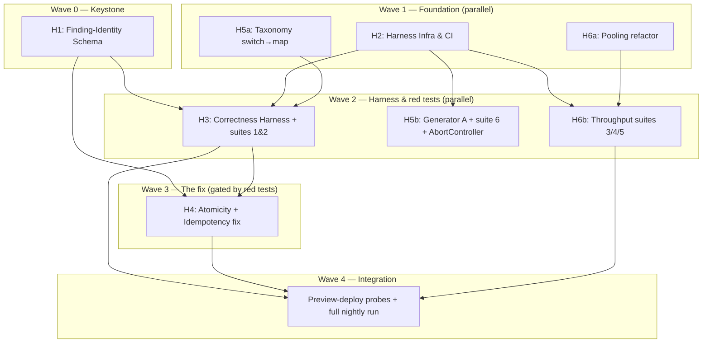

# Build Plan — Heavy System Testing + Correctness Launch Blockers (2026-06-29)

> Controller: **C0** | 6 Engineers (H1–H6) | 5 Waves | Target: ~2 weeks
>
> Derived from the grilling session persisted in [`heavy-system-testing.md`](heavy-system-testing.md)
> (20 decisions) and [`adr/0019-heavy-system-testing-scope.md`](adr/0019-heavy-system-testing-scope.md).
> Closes the correctness launch blockers in [`LAUNCH-BLOCKERS.md`](LAUNCH-BLOCKERS.md): **Transaction
> Atomicity** (ADR 0017) and **Duplicate Findings / no unique constraint** (the fourth blocker the
> grilling surfaced).

## Scope & philosophy

Two interlocked tracks, sequenced **red-before-green** (the harness's failing tests are the
acceptance bar for the fixes — ADR 0019 §5):

- **Harness track** — the batch-pipeline correctness/concurrency harness: two data generators, six
  test suites, branch-provisioning infra, two-speed CI.
- **Fix track** — the code/schema changes the harness gates: the atomicity migration (ADR 0017), the
  finding-identity unique constraint (blocker #4), and three latent issues logged during grilling
  (taxonomy `default` fallthrough, `AbortController` leak, pooling-mode↔RLS).

**This is a planning document. No implementation code is written until C0 greenlights a wave.**

### Relationship to the v2 roster (avoid double-assignment)

The `sql.transaction()` atomicity work appears in [`BUILD-PLAN-PHASE2.md`](BUILD-PLAN-PHASE2.md) as
**E4**, but that wave shipped *schema-integrity* (FKs/CHECKs) — the transaction migration is **still
open** (LAUNCH-BLOCKERS.md → Transaction Atomicity, unchecked). **H4 in this plan realizes that
still-open E4 transaction work and extends it** with the unique-constraint fix. Do not run a separate
v2-E4 transaction effort in parallel; H4 is the single owner.

## Dependency graph

## Engineer roster

| ID | Agent file | Wave | Role | Parallel? |
|----|-----------|------|------|-----------|
| C0 | `HC0-controller.agent.md` | All | Project lead, PR gate, schema approval, invariant compliance | — |
| H1 | `H1-finding-identity.agent.md` | 0 | **Keystone** — `subject_id`/`subject_type` columns + backfill + engine population | No |
| H2 | `H2-harness-infra.agent.md` | 1 | Neon-branch provisioning, snapshot guard, two-speed CI, vitest gating | No |
| H3 | `H3-correctness-harness.agent.md` | 2 | Generator B + pinned rulebook fixture + oracle + suite 1 + suite 2 (red) | Yes |
| H4 | `H4-atomicity-fix.agent.md` | 3 | ADR 0017 inversion + `UNIQUE` + `ON CONFLICT` + finding-level skip (red→green) | No |
| H5 | `H5-resilience-harness.agent.md` | 1→2 | Generator A + suite 6 fault injection + AbortController fix + taxonomy map | Yes |
| H6 | `H6-throughput-connection.agent.md` | 1→2 | Suites 3/4/5 + pooling remediation + RLS-through-pooler assertion | Yes |

**To invoke an engineer:** `runSubagent({ agentName: "H1-finding-identity", prompt: "Start Wave 0." })`

---

## Controller: C0

**Role**: Gatekeeper. No code reaches `main` without C0 review. Owns cross-cutting docs and every
schema migration.

**Responsibilities**:
- Assign waves; enforce the red-before-green sequence (H3's suite 2 must be merged **and failing**
  before H4 starts).
- Review every PR against CLAUDE.md invariants #1–10 (esp. #1 completeness, #2 run isolation, #3
  transaction safety, #5 rulebook precedence, #7/#8 gateway taxonomy).
- Final approval on `db/migrations/*` and `db/schema.ts`.
- Run `npm test` + `npm run build` + `npx tsx db/migrate.ts` between waves.
- Keep [`LAUNCH-BLOCKERS.md`](LAUNCH-BLOCKERS.md) checkboxes accurate; mark the two correctness
  blockers done only when suites 1–2 are green.

**Checkpoints**:
- [x] **Wave 0** — `subject_id`/`subject_type` exist, backfilled; both engines populate them; existing tests pass. ✅ (commit `3ec8a73`)
- [x] **Wave 1** — harness provisions an ephemeral Neon branch + snapshot guard; two-speed CI scaffolded; taxonomy map + pooling refactors merged behind no behavior change. ✅ (commits `e41bba9`, `8bccce7`)
- [ ] **Wave 2** — suite 1 green on current logic; **suite 2 RED** (reproduces duplicates); suite 6 reproduces the AbortController hang.
- [ ] **Wave 3** — H4 merged; **suite 2 GREEN**; rollback test proves whole-array rollback; both correctness launch blockers closed.
- [ ] **Wave 4** — preview-deploy probes (4/5) measured and recorded; full nightly suite green; connection-ceiling decision logged.

---

## Wave 0 — Keystone (solo)

### H1: Finding-Identity Schema

> **Keystone gate.** The oracle (H3) needs a clean scalar key, and the fix (H4) needs the column to
> hang `UNIQUE` on. Nothing else proceeds until this lands. Adds the columns and population **without**
> the unique constraint — duplicates must still be *possible* so H3's suite 2 can reproduce them.

**Context docs**: `CLAUDE.md` (inv. #1–3, #7), `docs/data-layer.md`, `docs/audit-engine.md`,
[`heavy-system-testing.md`](heavy-system-testing.md) (Finding identity), decisions 10–13, 17.

**Files owned by H1**:
| File | Action |
|------|--------|
| `db/migrations/0026_finding_subject_identity.sql` | NEW: add `subject_id` + `subject_type` columns + best-effort backfill (**no** `UNIQUE` yet) |
| `db/schema.ts` | Add the two columns to the `"Audit Results"` read-model |
| `lib/audit/engine.ts` | Parcel insert sets `subject_type='parcel'`, `subject_id = f.invoiceId` |
| `lib/audit/3pl-engine.ts` | 3PL insert sets `subject_type='tpl'`, `subject_id = line.id` (the **line id**, not `order_id`); keep `order_id` as a reference column |

**Tasks**:
1. **Migration** — `ALTER TABLE "Audit Results" ADD COLUMN subject_type text, ADD COLUMN subject_id text;`
   then backfill: `subject_type='parcel', subject_id=("Invoice")[1]` where `"Invoice"` is non-null;
   `'tpl'` + existing order linkage otherwise (best-effort; near-zero pre-launch data). No `UNIQUE`.
2. **Parcel engine** — populate the two columns in the record map at [`engine.ts:125-139`](../lib/audit/engine.ts).
   Leave the raw `BEGIN/COMMIT` for H4 — H1 does not touch the transaction shape.
3. **3PL engine** — populate at [`3pl-engine.ts:79-94`](../lib/audit/3pl-engine.ts) with **line id** as
   `subject_id`. This is the decision-17 correction that prevents the per-cycle `TPL_DUPLICATE`
   collision; verify a duplicate-cycle order yields two distinct `subject_id`s.
4. **Schema + smoke** — update `db/schema.ts`; `npx tsx db/migrate.ts` applies idempotently.

**Acceptance**: columns exist and are populated by both engines; a seeded duplicate-cycle 3PL order
produces two rows with distinct `subject_id`; **no** unique constraint yet (duplicates still possible);
`npm test` + `npm run build` pass.

**Deliverables**: 1 PR. **C0 schema approval required.**

---

## Wave 1 — Foundation (parallel, no file overlap)

### H2: Harness Infra & CI

**Context docs**: `CLAUDE.md`, `docs/data-protection.md` (TEST_DATABASE_URL pattern),
[`heavy-system-testing.md`](heavy-system-testing.md) (Environment, CI gating), decisions 8, 14.

**Files owned by H2**:
| File | Action |
|------|--------|
| `lib/__tests__/harness/branch.ts` | NEW: ephemeral Neon-branch create→seed→test→destroy (teardown in `finally`) |
| `lib/__tests__/harness/schema-snapshot.ts` | NEW: `information_schema` introspection + drift assert |
| `lib/__tests__/harness/db.ts` | NEW: gate on `TEST_DATABASE_URL`; provision via `db/migrate.ts` |
| `.github/workflows/ci.yml` | Two-speed: per-PR correctness gate (ephemeral branch) + nightly measured job |
| `vitest.config.ts` / `package.json` | Test scripts: `test:correctness` (gate), `test:heavy` (nightly) |

**Tasks**:
1. **Branch lifecycle** — create an ephemeral branch off `main`'s schema via the Neon API/MCP,
   provision with `npx tsx db/migrate.ts` (the **DB is the faithfulness oracle** — decision 14),
   expose its URL as `TEST_DATABASE_URL`, destroy in `finally`. Fallback path: a pre-provisioned
   `test` branch the harness `TRUNCATE`s + re-seeds (documented, no CI branch creds).
2. **Snapshot guard** — introspect columns/constraints on the seeded branch once; fail fast with a
   readable diff if they drift from what generators target.
3. **Two-speed CI** — per-PR job runs `test:correctness` (suites 1–2, small seed) as a **hard gate**;
   nightly job runs `test:heavy` (suites 3–6, large seed) **non-blocking, measured**. Gate boundary =
   correctness-vs-performance.
4. **Token/secret wiring** — Neon API token scoped to branch create/destroy; document the fallback.

**Acceptance**: a no-op test provisions + tears down an ephemeral branch in CI; snapshot guard fails a
deliberately-drifted seed; per-PR vs nightly jobs run the correct suite sets.

**Deliverables**: 1 PR. C0 reviews CI wiring.

### H5a: Taxonomy `switch` → map refactor (behavior-preserving)

> Split from H5 so it can land in Wave 1 with no harness dependency. Pure refactor — H3's registry
> guard (Wave 2) then enforces it.

**Files owned by H5a**: `lib/intelligence/taxonomy.ts`.

**Tasks**:
1. Refactor `defaultGatewayTagForRule`'s `switch` ([`taxonomy.ts:145-251`](../lib/intelligence/taxonomy.ts))
   into an explicit `Record<RuleCode, GatewayTag>` map so a missing rule-code key is a structural
   (lookup/type) error, not a silent `default` fallthrough. Preserve every existing mapping exactly
   (incl. the deliberate `DUPLICATE_TRACKING` → `UNKNOWN`).
2. Keep `validateGatewayTag` (the PREVENTABLE→suggestion enforcement, inv. #8) unchanged.

**Acceptance**: `lib/intelligence/taxonomy.test.ts` passes unchanged; adding a fake rule code without a
map entry fails to compile or throws a clear error (not a silent `UNKNOWN`). Logged latent bug
(LAUNCH-BLOCKERS deferred) marked resolved.

**Deliverables**: 1 PR.

### H6a: Connection-pooling refactor (behavior-preserving)

> Split from H6 so the `lib/db.ts` change lands before the throughput suites measure it.

**Files owned by H6a**: `lib/db.ts`.

**Tasks**:
1. Fold the 4-round-trip tenant checkout (`RESET ROLE`/`RESET tenant`/`SET ROLE`/`SET tenant`,
   [`db.ts:73-76`](../lib/db.ts)) into `SET LOCAL` inside an explicit transaction — fewer round-trips,
   pooler-safe, no stale-session reset dance.
2. Add an explicit `Pool max` (backstop for serverless fan-out); parameterize the connection string so
   the tenant pool *can* target a `-pooler` endpoint (env var), **defaulting to current behavior** so
   this PR changes no runtime behavior until H6b decides the endpoint.

**Acceptance**: `rls-isolation.test.ts` passes unchanged (tenant scoping preserved); no behavior change
at default config.

**Deliverables**: 1 PR. **C0 review (touches the tenancy security path).**

---

## Wave 2 — Harness & red tests (parallel, depends on W0 + W1)

### H3: Correctness Harness — Generator B + suites 1 & 2

**Context docs**: `CLAUDE.md` (inv. #1, #2, #5, #7, #8), `docs/audit-engine.md`,
[`heavy-system-testing.md`](heavy-system-testing.md) (Generator B, Finding identity, suites 1–2),
decisions 2, 4, 6, 10–18, 20.

**Files owned by H3**:
| File | Action |
|------|--------|
| `lib/__tests__/harness/generator-b.ts` | NEW: audit-anomaly generator (direct-insert, schema-faithful) |
| `lib/__tests__/harness/rulebook-fixture.ts` | NEW: pinned multi-scope rulebook + fallback-baseline subset |
| `lib/__tests__/harness/oracle.ts` | NEW: ground-truth set keyed `(subject_type, subject_id, "Detected by")` |
| `lib/__tests__/heavy/suite1-correctness.test.ts` | NEW: set-equality, completeness (parcel + 3PL), reconciliation, run-isolation, taxonomy |
| `lib/__tests__/heavy/suite2-concurrency.test.ts` | NEW: concurrent runs → **must reproduce duplicates (RED)** |

**Tasks**:
1. **Generator B** — deterministic (logged seed), inserts direct to normalized tables, `created_at`
   set explicitly per row (three time-classes around pivot `T`), planted anomalies for all 6 rule
   families relative to *resolved* thresholds + boundary cases.
2. **Rulebook fixture** — multi-scope rows (global+carrier+contract) for each rule_key (exercises #5)
   + a fallback-baseline subset (no row → asserts hardcoded `fallback`); explicit ship/effective dates
   so the resolver's `new Date()` branch is never taken.
3. **Suite 1 assertions** — set-equality on the natural key; parcel completeness
   (`distinct invoices == total`); 3PL completeness (`lines audited == lines in scope`); reconciliation
   **summed in SQL, compared on integer cents**, plus per-finding round-trip; run-isolation
   before/at/after + second-run inclusion; gateway taxonomy tuple per anomaly.
4. **Suite 2 (RED)** — fire concurrent `runAudit`/`claimNextJob`/process-route calls over one seeded
   set; assert exactly one finding per natural key + no double-claim + idempotent re-run. **This must
   FAIL on Wave-0 code** (no unique constraint → duplicates). Document the failure as the acceptance
   bar for H4.

**Acceptance**: suite 1 **green** on current single-run logic; suite 2 **red** with a clear duplicate
diff; both run on the ephemeral branch via H2's harness.

**Deliverables**: 1 PR (may split generator vs suites). C0 confirms suite 2 is red before H4 starts.

### H5b: Resilience Harness — Generator A + suite 6 + AbortController fix

**Context docs**: `CLAUDE.md` (inv. #3, #4), `docs/ingestion.md`,
[`heavy-system-testing.md`](heavy-system-testing.md) (Generator A, suite 6), decisions 7, 9.

**Files owned by H5b**:
| File | Action |
|------|--------|
| `lib/__tests__/harness/generator-a.ts` | NEW: dirty-input generator (raw payloads through staging) |
| `lib/__tests__/heavy/suite6-fault-injection.test.ts` | NEW: vision seam + carrier/SFTP wire mocks |
| `lib/intelligence/vision/__mocks__/faulty-backend.ts` | NEW: `FaultyVisionBackend` on the `VisionExtractor` seam |
| `lib/llm/client.ts` | **Fix**: pass `AbortController.signal` to `fetch` (timeout actually aborts) |

**Tasks**:
1. **Generator A** — emits structural/type/referential/duplicate/adversarial freight flaws; asserts
   the three invariants (no silent loss; no corruption-or-partial-write; no crash). Idempotent
   re-upload is the highest-value case. Runs as **non-blocking nightly fuzz**; failing inputs promote
   to deterministic fixtures.
2. **Suite 6** — `FaultyVisionBackend` via the `VisionExtractor` seam; carrier/SFTP via transport
   mocks returning 500/timeout/slow. Assert: retry/backoff fires then lands an inspectable `failed`
   row (no crash); mid-batch fault → **no partial financial write** (third probe of the atomicity
   guarantee).
3. **AbortController fix** — wire `signal` into the `fetch` at [`lib/llm/client.ts:211`](../lib/llm/client.ts);
   the slow-response test asserts the call aborts within budget. (Built as a known-red test first, then
   fixed — decision 9.)

**Acceptance**: Generator A's three invariants hold across the flaw taxonomy; suite 6 timeout test goes
red on current code then green after the signal fix; mid-batch fault leaves no partial write.

**Deliverables**: 1–2 PRs. The AbortController fix is small and may merge independently.

### H6b: Throughput & Connection — suites 3/4/5

**Context docs**: `CLAUDE.md`, `docs/data-protection.md`,
[`heavy-system-testing.md`](heavy-system-testing.md) (suites 3–5), decisions 5, 19.

**Files owned by H6b**:
| File | Action |
|------|--------|
| `lib/__tests__/heavy/suite3-drain-rate.test.ts` | NEW: enqueue spike, measure 1-job/min drain arithmetic |
| `lib/__tests__/heavy/suite4-connection-ceiling.ts` | NEW: thin HTTP probe (preview) — find the `Pool` knee |
| `lib/__tests__/heavy/suite5-claim-race.ts` | NEW: many concurrent `/api/run-audit/process` (true multi-instance) |
| `lib/__tests__/heavy/rls-pooler.test.ts` | NEW: **RLS isolation holds through the pooled endpoint** |

**Tasks**:
1. **Suite 3** — enqueue a realistic onboarding spike; measure drain vs the `* * * * *` single-claim
   poller; **surface** the latency-to-results (e.g. "200 jobs → 3.3 h") as a product decision, not a
   pass/fail.
2. **Suite 4** — drive concurrent requests through `getTenantSql`; **first verify** whether
   `DATABASE_URL` is the direct or `-pooler` host; record the knee; recommend `Pool max` / endpoint.
3. **Suite 5** — many concurrent process-route calls at a preview deployment (the one true-concurrency
   case a single local process can't fake).
4. **RLS-through-pooler (hard assertion)** — if H6a's pooled endpoint is adopted, prove tenant
   isolation still holds in **session-mode** (transaction-mode silently breaks `SET app.current_tenant`).
   A pooling-mode mistake here is a silent cross-tenant leak.

**Acceptance**: suites 3/5 produce recorded measurements; suite 4 records the knee + an endpoint
decision; the RLS-through-pooler test passes (or blocks adoption of a transaction-mode pooler).

**Deliverables**: 1 PR (suites are measured/non-blocking except the RLS assertion, which is a gate).

---

## Wave 3 — The fix (sequential, gated by Wave 2 red tests)

### H4: Atomicity + Idempotency Fix (ADR 0017 + blocker #4)

> Starts **only after** H3's suite 2 is merged and red. Realizes the still-open v2-E4 transaction work
> and adds the unique constraint. Turns suite 2 green.

**Context docs**: `CLAUDE.md` (inv. #3), `docs/data-layer.md`, `docs/audit-engine.md`,
[`adr/0017-...md`](adr/0017-batchcreate-transaction-composable-query-builder.md),
[`heavy-system-testing.md`](heavy-system-testing.md) (Finding identity), decisions 11–13, 17.

**Files owned by H4**:
| File | Action |
|------|--------|
| `lib/db/records.ts` | Invert `batchCreate` → `insertQueries(txn, table, records)`; remove `inTransaction`; thin wrapper on `sql.transaction()` |
| `lib/audit/engine.ts` | Replace raw `BEGIN/COMMIT` with `sql.transaction((txn) => [...insertQueries, txn.query(update)])`; add `ON CONFLICT DO NOTHING`; narrow skip to finding-level |
| `lib/audit/3pl-engine.ts` | Same transaction migration + `ON CONFLICT DO NOTHING` on `persistPage` |
| `db/migrations/0027_finding_unique_constraint.sql` | NEW: `UNIQUE(subject_type, subject_id, "Detected by")` |
| `lib/__tests__/heavy/suite2-concurrency.test.ts` | Confirm it flips to **green** (owned by H3; H4 must not weaken it) |

**Tasks**:
1. **Invert `batchCreate`** (ADR 0017 decision) — `insertQueries` returns unsent parameterized queries
   from the txn handle; `batchCreate` becomes `sql.transaction((txn) => insertQueries(...))`; delete
   `inTransaction`; grep + migrate every caller.
2. **Both engines** — fold inserts + the sibling update (`Clients."Last audit run"` / `audit_status`)
   into one `sql.transaction((txn) => [...])`; remove the false "verified working via session pinning"
   comments; add `ON CONFLICT (subject_type, subject_id, "Detected by") DO NOTHING`.
3. **Unique constraint migration** — add it **after** H1's columns + backfill; verify no existing dup
   blocks creation (clean up dups in the migration if any survive backfill).
4. **Finding-level skip** — narrow the parcel invoice-level `continue` ([`engine.ts:97`](../lib/audit/engine.ts))
   to the `(subject, rule)` grain (now a perf optimization; correctness lives in the constraint).
5. **Rollback test** — a failing statement rolls back the whole array, both engines.

**Acceptance**: no raw `BEGIN/COMMIT` on `getSql()` in any financial write path; **suite 2 green**
(exactly one finding per natural key, no double-claim, idempotent re-run); rollback test passes;
`TPL_DUPLICATE` multi-cycle findings are **preserved** (distinct `subject_id`s, not collapsed by
`ON CONFLICT`). C0 marks both correctness launch blockers done.

**Deliverables**: 1 PR (shared-layer + both engines + migration). **C0 schema + invariant approval required.**

---

## Wave 4 — Integration

- Run the **full nightly suite** (1–6) on a large seed against an ephemeral branch.
- Execute H6b's **preview-deployment probes** (suites 4/5) on a real multi-instance deploy; record the
  connection knee and the endpoint/`Pool max` decision in [`heavy-system-testing.md`](heavy-system-testing.md).
- Confirm the four independent atomicity probes (suite 2 concurrency, generator-A mid-batch, suite-6
  downstream-fault, the unique constraint) all hold together.
- C0 closes the wave when correctness suites are green in CI and performance results are recorded.

---

## File ownership matrix (conflict resolution)

| File | Owner(s) — sequence |
|------|---------------------|
| `lib/audit/engine.ts` | H1 (W0: populate `subject_*`) → H4 (W3: transaction + `ON CONFLICT` + skip) |
| `lib/audit/3pl-engine.ts` | H1 (W0) → H4 (W3) |
| `lib/db/records.ts` | H4 |
| `db/schema.ts` | H1 (C0 resolves) |
| `db/migrations/*` | H1 (0026), H4 (0027) — C0 approves; numbers via `MIGRATION_REGISTRY.md` |
| `lib/db.ts` | H6a |
| `lib/intelligence/taxonomy.ts` | H5a |
| `lib/llm/client.ts` | H5b |
| `lib/__tests__/harness/*` | H2 (infra), H3 (gen B/oracle), H5b (gen A) |
| `lib/__tests__/heavy/*` | H3 (1,2), H5b (6), H6b (3,4,5, rls-pooler) |
| `.github/workflows/ci.yml` | H2 |

**C0 resolves conflicts on** `engine.ts` / `3pl-engine.ts` (H1→H4 sequential — H1's `subject_*`
population must merge before H4 rebases its transaction change on top).

---

## CI / quality gates

Between every wave:
1. `npm test` — full unit suite passes.
2. `npm run build` — no type errors.
3. `npx tsx db/migrate.ts` — migrations apply idempotently on a fresh branch.
4. C0 approval on every PR; schema PRs (H1, H4) get explicit invariant review.

Wave-specific gates:
5. **End of Wave 2**: suite 1 green, **suite 2 red** (documented) — the green light for H4.
6. **End of Wave 3**: suite 2 green, rollback test green, both correctness blockers checked off in
   `LAUNCH-BLOCKERS.md`.
7. **Wave 4**: RLS-through-pooler assertion green; connection-ceiling decision recorded.
